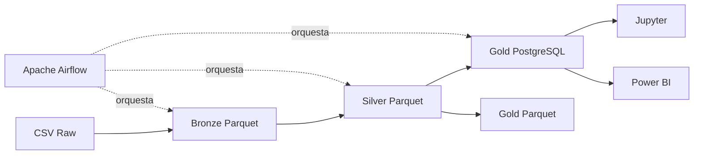

# GoTech Data Engineering Challenge

Solución integral de Ingeniería de Datos para consolidar información de tres dominios de una institución educativa: **University**, **Billing** y **CRM**.

El proyecto implementa un pipeline reproducible desde archivos CSV hasta modelos analíticos en PostgreSQL y Parquet. Incluye perfilado, controles de calidad, capas Bronze, Silver y Gold, orquestación con Apache Airflow, análisis ejecutable en Jupyter y un dashboard de Power BI.

## Objetivo

Transformar 18 archivos CSV de sistemas independientes en contratos analíticos útiles para:

- medir rendimiento y permanencia académica;
- analizar facturación, pagos, productos y suscripciones;
- evaluar leads, oportunidades y actividad comercial;
- integrar University y Billing mediante una clave confiable;
- exponer los problemas de calidad sin eliminarlos ni ocultarlos.

## Arquitectura



Docker Compose levanta PostgreSQL, Airflow y Jupyter. El DAG se ejecuta manualmente (`schedule=None`) y reconstruye las capas en el orden Bronze → Silver → Gold sin duplicar registros.

## Fuentes de datos

| Dominio | Archivos | Filas |
|---|---:|---:|
| University | 6 | 90.508 |
| Billing | 6 | 305.200 |
| CRM | 6 | 51.000 |
| **Total** | **18** | **446.708** |

Los datos originales no se versionan en Git. El ZIP final de entrega sí incluye los 18 CSV en `data/raw/` para facilitar la reproducción. En un clon del repositorio deben ubicarse con esta estructura:

```text
data/raw/
├── billing/       # 6 CSV
├── crm/           # 6 CSV
└── university/    # 6 CSV
```

## Tecnologías y decisiones

| Tecnología | Uso | Justificación |
|---|---|---|
| Python y pandas | Ingesta, transformación y validación | Flexibilidad y reglas explícitas versionadas |
| Parquet | Capas Bronze, Silver y exportación Gold | Tipado, compresión y lectura columnar eficiente |
| PostgreSQL | Persistencia oficial de Gold | Consultas SQL y conexión directa con Power BI |
| Apache Airflow | Orquestación Bronze → Silver → Gold | Dependencias, reintentos, logs y trazabilidad |
| Docker Compose | Ambiente reproducible | Servicios aislados con configuración declarativa |
| Jupyter | Documentación técnica y análisis | Código, resultados, gráficos e insights en un mismo artefacto |
| Power BI | Dashboard analítico | Consumo ejecutivo de KPIs y alertas de calidad |
| Git | Control de versiones | Evidencia incremental de decisiones e implementación |

## Requisitos previos

- Docker Desktop con Docker Compose.
- Power BI Desktop para abrir o actualizar el dashboard.
- Los 18 CSV originales en `data/raw/`.
- Puertos locales disponibles: PostgreSQL `5432`, Airflow `8080` y Jupyter `8888` (configurables en `.env`).

## Inicio rápido

### 1. Configurar variables

Desde PowerShell, en la raíz del repositorio:

```powershell
Copy-Item .env.example .env
```

Edita `.env` y reemplaza los valores de ejemplo, especialmente `POSTGRES_PASSWORD` y `JUPYTER_TOKEN`. El archivo `.env` está excluido de Git.

### 2. Levantar el ambiente

```powershell
docker compose up -d --build
docker compose ps
```

Servicios disponibles:

- Airflow: <http://localhost:8080>
- JupyterLab: <http://localhost:8888/lab>
- PostgreSQL: `localhost:5432`

### 3. Ejecutar el pipeline

```powershell
docker compose exec airflow airflow dags trigger gotech_bronze_silver_gold
```

Consultar el historial:

```powershell
docker compose exec airflow airflow dags list-runs gotech_bronze_silver_gold
```

El DAG ejecuta tres tareas:

```text
build_bronze
    ↓
build_and_validate_silver
    ↓
build_and_validate_gold
```

### 4. Abrir los notebooks

En JupyterLab, ejecuta en orden:

1. `notebooks/01_pipeline_documentation.ipynb`
2. `notebooks/02_gold_analysis.ipynb`

Los notebooks versionados incluyen sus resultados y no contienen errores de ejecución.

## Capas del pipeline

### Raw

CSV originales, preservados sin modificaciones.

### Bronze

Copia estructural de Raw en Parquet, organizada por dominio. Conserva filas y columnas para mantener trazabilidad.

### Silver

Aplica tipado de fechas, reglas cronológicas, validaciones de PK/FK, rangos numéricos, categorías permitidas y controles de reconciliación. Las filas no se eliminan silenciosamente: los atributos inválidos se marcan mediante banderas de calidad.

### Gold

Publica siete contratos analíticos en PostgreSQL y Parquet:

| Tabla | Grano | Filas |
|---|---|---:|
| `gold.academic_performance` | Una fila por inscripción | 25.000 |
| `gold.invoice_financial` | Una fila por factura | 50.000 |
| `gold.product_sales` | Una fila por línea de factura | 150.000 |
| `gold.subscription_portfolio` | Una fila por suscripción | 15.000 |
| `gold.crm_opportunity` | Una fila por oportunidad | 3.000 |
| `gold.crm_lead` | Una fila por lead | 2.000 |
| `gold.student_360` | Una fila por estudiante | 5.000 |

La relación integrada utiliza:

```text
billing.customers.external_ref = university.students.student_id
```

CRM permanece como mart independiente porque no existe una clave confiable que permita integrarlo con University o Billing.

## Calidad de datos

Principales hallazgos conservados y expuestos en Gold:

- 22.645 inscripciones con pesos de calificación que no suman 1.
- 2.502 facturas sin líneas.
- 47.497 facturas con líneas cuya suma difiere del total de cabecera.
- 49.999 facturas sin líneas o con diferencia cabecera–detalle (indicador combinado).
- 18.567 facturas sin pagos.
- 29.510 facturas con saldo material superior a la tolerancia de 0,01.
- 29.515 facturas con saldo positivo si no se aplica tolerancia; cinco tienen
  exactamente 0,01 y no forman parte del KPI oficial.
- 783 suscripciones con fecha final inválida.
- 1.029 oportunidades con fecha de cierre inválida.
- 2 direcciones de correo repetidas en 4 contactos CRM.

Las métricas monetarias se analizan por moneda; no se suman monedas distintas sin tipos de cambio históricos.

Consulta el detalle en [`docs/data_quality_findings.md`](docs/data_quality_findings.md).

## Dashboard Power BI

El archivo [`powerbi/gotech_bootcamp_dashboard.pbix`](powerbi/gotech_bootcamp_dashboard.pbix) contiene cinco páginas:

1. Resumen Ejecutivo.
2. Rendimiento Académico.
3. Facturación y Productos.
4. Suscripciones y Student 360.
5. CRM.

La página financiera incluye un segmentador de moneda. La auditoría estructural y las comprobaciones manuales pendientes están documentadas en [`docs/power_bi_validation.md`](docs/power_bi_validation.md).

## Estructura del repositorio

```text
.
├── dags/                  # DAG de Airflow
├── data/                  # Raw y capas generadas (ignoradas por Git)
├── docker/                # Imágenes e inicialización de servicios
├── docs/                  # Diseño, calidad, implementación y validaciones
├── notebooks/             # Documentación técnica y análisis Gold
├── powerbi/               # Dashboard analítico
├── src/
│   ├── database/          # Conexión PostgreSQL
│   ├── ingestion/         # Discovery y Bronze
│   └── transformation/    # Silver y Gold
├── docker-compose.yml
└── requirements.txt
```

## Documentación adicional

- [`docs/PROJECT_BLUEPRINT.md`](docs/PROJECT_BLUEPRINT.md): alcance y estado final.
- [`docs/data_quality_findings.md`](docs/data_quality_findings.md): hallazgos y tratamiento.
- [`docs/gold_model_design.md`](docs/gold_model_design.md): diseño analítico y KPIs.
- [`docs/gold_implementation_summary.md`](docs/gold_implementation_summary.md): implementación de Gold.
- [`docs/airflow_implementation.md`](docs/airflow_implementation.md): ambiente y orquestación.
- [`docs/power_bi_dashboard_blueprint.md`](docs/power_bi_dashboard_blueprint.md): modelo, medidas y páginas.

## Limitaciones

- El DAG se dispara manualmente; no tiene calendario periódico.
- Billing contiene ocho monedas y no hay tipos de cambio históricos.
- `crm.opportunities.amount` no especifica moneda.
- CRM no tiene una clave confiable para integrarse con los otros dominios.
- Las diferencias entre facturas, líneas y pagos provienen de los datos fuente y se muestran explícitamente.
- El ambiente está diseñado para desarrollo, evaluación y demostración, no para producción distribuida.

## Estado

Pipeline Raw → Bronze → Silver → Gold completado y validado. Airflow, PostgreSQL, Jupyter y el dashboard Power BI se encuentran implementados.
